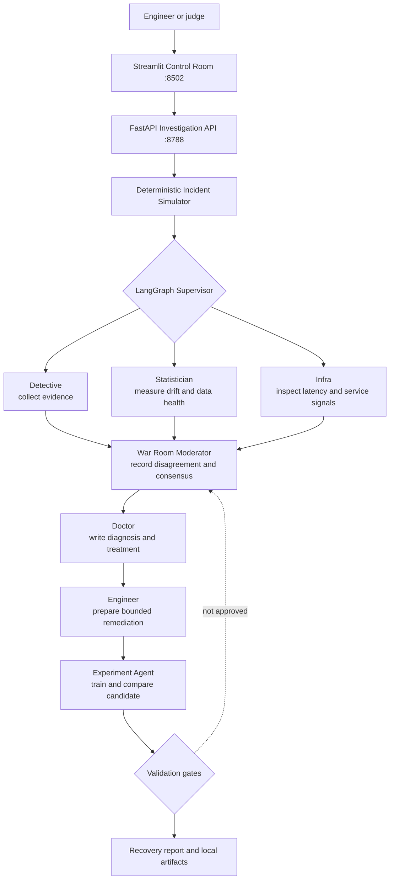

# SherlockML

> **An autonomous AI detective and doctor for machine-learning systems.**

SherlockML is a deterministic, offline-first laptop demo of a multi-agent ML
reliability investigation. It turns a synthetic fraud-model incident into an
auditable engineering case: agents gather evidence, debate competing causes,
recommend a treatment, run a recovery experiment, and produce a case report.

It is deliberately **not a chatbot**. The primary interaction is an
investigation control room: choose an incident and watch a constrained,
repeatable workflow produce evidence and a recommendation.

## How Codex and GPT-5.6 were used

SherlockML was built as a Codex-assisted hackathon project. Codex, powered by
GPT-5.6 during the build workflow, acted as the AI engineering partner across
the project rather than just a code autocomplete tool.

- **System design:** Codex helped turn the original idea into an autonomous ML
  reliability-engineer architecture with specialist agents, a supervisor
  workflow, safety boundaries, and a judge-friendly demo path.
- **Implementation:** Codex generated and iterated on the FastAPI service,
  Streamlit command room, deterministic incident simulator, ML training and
  evaluation utilities, agent orchestration, reports, and documentation.
- **Debugging and refinement:** Codex inspected runtime errors, tightened the
  UI, fixed type/test failures, validated API responses, and improved the demo
  flow until it was repeatable on a laptop.
- **Demo assets:** Codex produced the screen-by-screen walkthrough, PDF,
  architecture explanation, GitHub-ready README updates, and narrated demo
  videos from the live app.
- **Human oversight:** The final product intentionally mirrors the build
  process: AI can investigate, propose, and validate, but important promotion
  decisions remain reviewable by a human.

## The problem

Machine-learning systems can fail quietly. A model may continue serving
predictions while data distributions shift, feature transformations change, or
a new training configuration regresses quality. By the time an alert reaches a
human, the evidence can be scattered across metrics, data samples, code, and
deployment signals.

## Solution: the SherlockML approach

SherlockML stages a compact version of that incident-response loop against
synthetic data:

1. Start from a healthy fraud-model baseline.
2. Trigger a deterministic incident: data drift, a feature-pipeline bug, or a
   model-regression scenario.
3. Orchestrate specialist agents through a LangGraph supervisor.
4. Collect evidence, rank suspects, and record a War Room discussion.
5. Apply a controlled repair to the synthetic pipeline contract and preserve a
   reviewable diff/configuration artifact.
6. Compare baseline and candidate results against explicit validation gates.
7. Save a recovery report and artifacts for review.

The demo never uses customer data, calls a hosted model, deploys a model, or
acts on a remote repository. Its controlled local pipeline-contract repair is
shown as a diff artifact. It is designed to be safe to inspect, repeat, and
discuss in an interview or hackathon setting.

## What is in the demo

| Area | What a judge can see |
| --- | --- |
| Model health | A baseline fraud-model score, incident severity, and evidence timeline |
| Incident simulator | Reproducible synthetic drift, pipeline-bug, and regression scenarios |
| Multi-agent brain | Detective, Statistician, Infra, Moderator, Doctor, Engineer, and Experiment roles |
| War Room | A stored, evidence-linked debate rather than an opaque single answer |
| Recovery | A controlled local pipeline-contract repair, diff, candidate experiment, gates, and report |
| Dashboard | A Streamlit control room backed by a FastAPI API |

The exact metric values are generated from the selected synthetic scenario and
seed. They are **demo observations**, not claims about a deployed fraud model.

## Architecture



See [the architecture guide](docs/ARCHITECTURE.md) for the data flow, agent
responsibilities, and safety boundaries.

## Quick start

Requirements: Python 3.10+ and a virtual environment. Docker is optional.

```bash
cd /Users/kaiwenmei/Desktop/SherlockML
python3 -m venv .venv
source .venv/bin/activate
make install
```

In separate terminals, run the API and control room:

```bash
make run-api
make run-ui
```

Open the Streamlit dashboard at <http://127.0.0.1:8502>. The API is available
at <http://127.0.0.1:8788>, with interactive API documentation at
<http://127.0.0.1:8788/docs> when the server is running.

To verify the project before a demo:

```bash
make check
```

### Local API quick reference

| Method | Path | Purpose |
| --- | --- | --- |
| GET | /health | Check that the local service is live. |
| GET | /api/incidents | List the deterministic demo scenarios. |
| POST | /api/incidents/{incident_type}/investigate | Run one bounded investigation. |
| POST | /api/reset | Restore the synthetic pipeline contract baseline. |

Supported incident types are data_drift, pipeline_bug, and model_regression.
The dashboard also accepts the friendly feature_pipeline_bug alias. These are
local demo actions only.

## Demo: five moves

1. Open the dashboard and establish the healthy baseline.
2. Trigger a scenario such as **Data Drift**.
3. Select **Investigate Incident** and watch the Evidence Timeline and War
   Room fill in.
4. Inspect the proposed remediation and the candidate experiment comparison.
5. Read the approval decision and generated recovery report.

The [demo script](docs/DEMO_SCRIPT.md) includes a concise judge-facing
narrative and a recovery drill. For a screen-by-screen guide with live
screenshots of every dashboard page, see the
[demo walkthrough](docs/demo/DEMO_WALKTHROUGH.md) — also available as a
shareable PDF at
[docs/demo/SherlockML-Demo-Walkthrough.pdf](docs/demo/SherlockML-Demo-Walkthrough.pdf)
(regenerate it with `python3 docs/demo/make_pdf.py`).

## Project layout

```text
SherlockML/
├── agents/        # Specialist investigation roles and LangGraph orchestration
├── api/           # FastAPI application and investigation interface
├── dashboard/     # Streamlit control room
├── ml/            # Training, evaluation, prediction, and drift utilities
├── simulator/     # Deterministic synthetic incident generators
├── experiments/   # Optional scratch space; runtime records live under artifacts/
├── models/        # Generated local model artifacts
├── artifacts/     # Case reports and evidence snapshots
├── runtime/       # Ephemeral local state
├── tests/         # Deterministic test suite
└── docs/          # Architecture, runbook, study material, and demo guidance
```

## Running with Docker (optional)

The default Compose command runs only the API:

```bash
docker compose up --build
```

The dashboard lives behind an explicit profile so a judge can choose it only
when needed:

```bash
docker compose --profile dashboard up --build
```

This is local-container packaging, not a production deployment. Compose writes
generated artifacts to the local `artifacts/` and `runtime/` folders.

## Optional integrations, honestly scoped

- **MLflow:** local SQLite-backed experiment tracking only. The laptop demo does
  not use an MLflow server or remote artifact store; portable case artifacts
  remain the canonical demo evidence and the fallback if tracking is unavailable.
- **Git:** a controlled local repair always produces diff evidence. An optional
  local commit can be enabled, but the demo never requires credentials, pushes
  branches, or claims to deploy a fix.
- **Docker:** optional reproducible packaging for the FastAPI service and
  dashboard. It is not Kubernetes, CI/CD, or a production runtime.

The [implementation matrix](docs/IMPLEMENTATION_MATRIX.md) distinguishes what
is runnable locally from optional and design-only paths.

## Learning and interview use

SherlockML is intentionally compact enough to understand end to end. Start
with the [study guide](docs/STUDY_GUIDE.md), then use the
[runbook](docs/RUNBOOK.md) to rehearse both the happy path and a failure /
recovery drill.

## Safety and reproducibility

- All input data is generated synthetic fraud-like data.
- A fixed seed makes the default scenarios repeatable.
- Artifacts stay on the laptop unless the operator explicitly chooses another
  path.
- The repair applies only to the synthetic local pipeline contract. A validation
  decision is an engineering recommendation for review, not a production rollout.

## License and scope

This repository is a technical demonstration and interview-study project. It
is not a fraud decisioning system, a production monitoring platform, or a
substitute for security, compliance, model-risk, or human approval processes.
