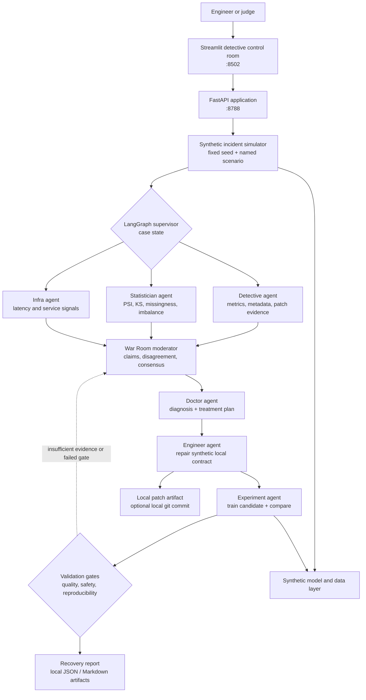

# SherlockML architecture

SherlockML is a deterministic incident-response laboratory, not a production
autopilot. Its architecture makes each decision inspectable: an incident creates
evidence, specialist agents turn that evidence into competing hypotheses, and a
candidate change must pass explicit gates before the system calls it a recovery.

## System view

## Components and responsibilities

| Component | Responsibility | Input | Output |
| --- | --- | --- | --- |
| Streamlit dashboard | Makes the case observable and drives a named scenario | operator action | health view, evidence board, War Room, recovery view |
| FastAPI app | Thin local interface around a single investigation run | dashboard/API request | serialized case state and health endpoint |
| Incident simulator | Produces reproducible failure conditions | incident name, seed | baseline and affected synthetic data/metrics |
| LangGraph supervisor | Controls order, state, and routes after failed validation | typed case state | an auditable sequence of agent outputs |
| Detective | Assembles operational and change evidence | metrics, metadata, local patch evidence | case file and suspect list |
| Statistician | Quantifies population and label/feature shifts | train/production samples | drift tests and findings |
| Infra | Checks simulated non-model causes | latency/error signals | infrastructure findings |
| War Room moderator | Preserves hypotheses and resolves them with evidence | findings from specialists | consensus, dissent, confidence |
| Doctor | Converts diagnosis into a bounded treatment plan | consensus | risk, severity, treatment, monitoring advice |
| Engineer | Applies a controlled synthetic config repair and preserves its diff | treatment plan | local contract change + patch artifact; no remote mutation |
| Experiment agent | Runs baseline/candidate comparison | candidate config and fixture data | metrics, experiment record, validation inputs |
| Validation | Applies explicit acceptance gates | comparison and evidence | approved-for-review or rejected decision |

## Investigation lifecycle

| Stage | What happens | Why it matters |
| --- | --- | --- |
| 1. Observe | Record baseline quality, latency, and data summary. | Establishes a comparison point. |
| 2. Trigger | Apply one named synthetic incident. | Keeps the failure causal and reproducible. |
| 3. Triage | Supervisor decides whether the reliability signal warrants investigation. | Avoids treating every metric movement as an incident. |
| 4. Collect | Detective, Statistician, and Infra agents inspect separate evidence. | Prevents one narrative from dominating too early. |
| 5. Debate | Moderator captures claims, disagreements, and evidence links. | Makes reasoning reviewable rather than magical. |
| 6. Diagnose | Doctor states condition, severity, and treatment. | Separates diagnosis from remediation. |
| 7. Repair | Engineer changes only the synthetic local contract and writes a diff artifact. | A human can inspect exactly what changed. |
| 8. Experiment | Candidate runs against the same deterministic evaluation context. | Enables a fair before/after comparison. |
| 9. Validate | Explicit gates decide whether the candidate is safe to recommend. | A metric increase alone is not enough. |
| 10. Report | Save the case timeline, evidence, patch, and decision. | Leaves an audit trail for learning and review. |

## Case state and artifacts

The supervisor carries a case state rather than free-form chat history. Typical
fields include a case identifier, scenario and seed, evidence, suspects, War
Room transcript, diagnosis, proposed patch, experiment comparison, validation
decision, and artifact paths. The exact Python types live with the orchestration
code; this document describes the boundary rather than a second source of truth.

A successful run writes reviewable local artifacts under `artifacts/`,
including reports, case diffs, and experiment records under
`artifacts/experiments/`. Generated state is ignored by Git so a fresh clone
remains clean and deterministic.

## Reliability scenarios

SherlockML intentionally narrows the problem to three diagnosable scenarios:

| Scenario | Simulated symptom | Primary evidence to expect | Illustrative treatment |
| --- | --- | --- | --- |
| Data drift | Transaction distribution changes after training. | PSI/KS shift, changed feature summary, degraded quality. | Retrain on representative window; add drift guardrail. |
| Feature-pipeline bug | A transform, scaling, or missing-value path is wrong. | Schema/missingness anomaly and patch evidence. | Repair preprocessing; add feature contract test. |
| Model regression | A training/config change weakens the candidate. | Version/parameter change and poorer comparison. | Revert or constrain configuration; rerun evaluation. |

These are synthetic teaching scenarios, not claims about a real insurance or
fraud operation.

## Determinism contract

The default demo is designed to work on one laptop, offline after dependencies
are installed.

- **Synthetic fixtures only.** No customer records, remote warehouse, or live
  endpoint is needed.
- **Fixed default seed.** The same named scenario yields the same expected
  evidence and comparable experiment result.
- **Local artifacts.** JSON/Markdown records are enough to inspect a run.
- **Bounded actions.** The only mutation is a controlled repair to the
  synthetic local pipeline contract, with its diff written as an artifact.
  Approval means “ready for human review,” never “deployed.”
- **No hidden service dependency.** MLflow, Git commits, and Docker enrich the
  demo but are not prerequisites for the core investigation.

## Validation philosophy

The candidate must be checked against the same kind of requirements a human ML
reliability engineer would use: quality improvement, floor thresholds, and
evidence that the proposed fix addresses the diagnosed cause. A run that does
not clear its gates produces a rejected or needs-review result and routes back
to the case discussion. This feedback loop is central to the demo: SherlockML
shows that autonomy without validation is only automation theater.

## Security and operational boundaries

- The FastAPI and Streamlit processes are local developer tools; they have no
  authentication or multi-tenant security model.
- Docker Compose exposes only local ports and mounts local artifact folders.
- Git auto-commit is disabled by default. If enabled, it is a local repository
  action only; remote pushes and GitHub changes are outside this project.
- MLflow records to a local SQLite database. No hosted tracking server or
  remote artifact bucket is configured.
- A real production system would add access control, secret management, model
  registry controls, monitoring infrastructure, approval workflows, and
  deployment rollback. Those are deliberately out of scope here.
