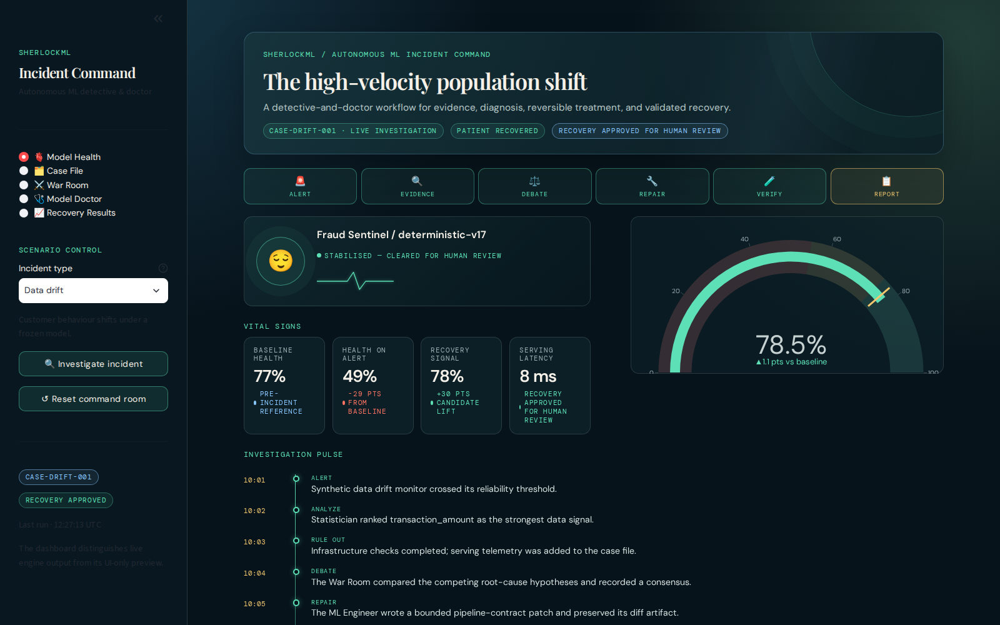
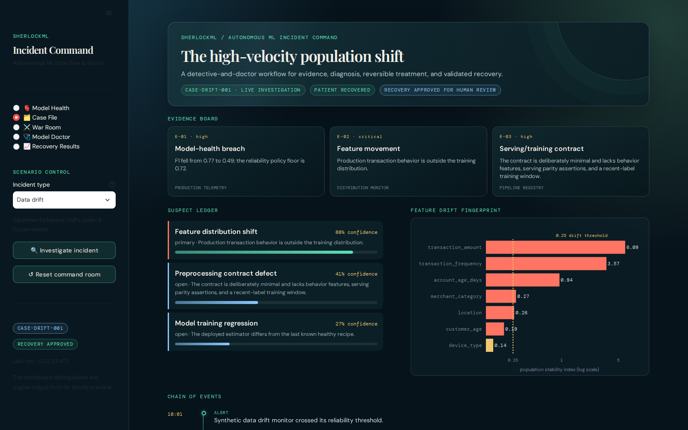
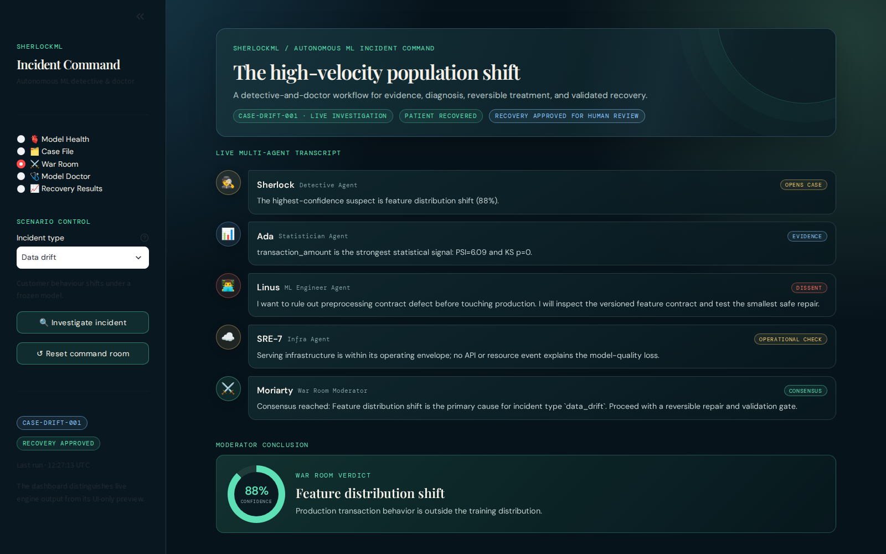
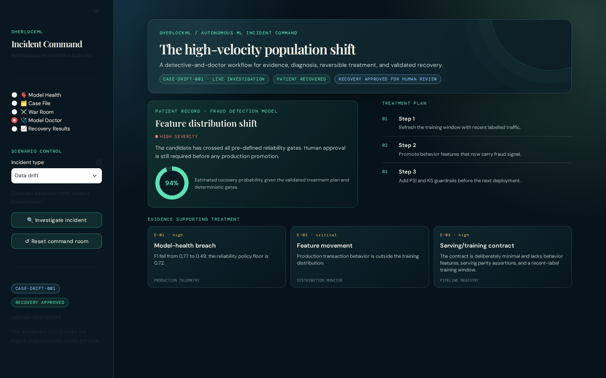
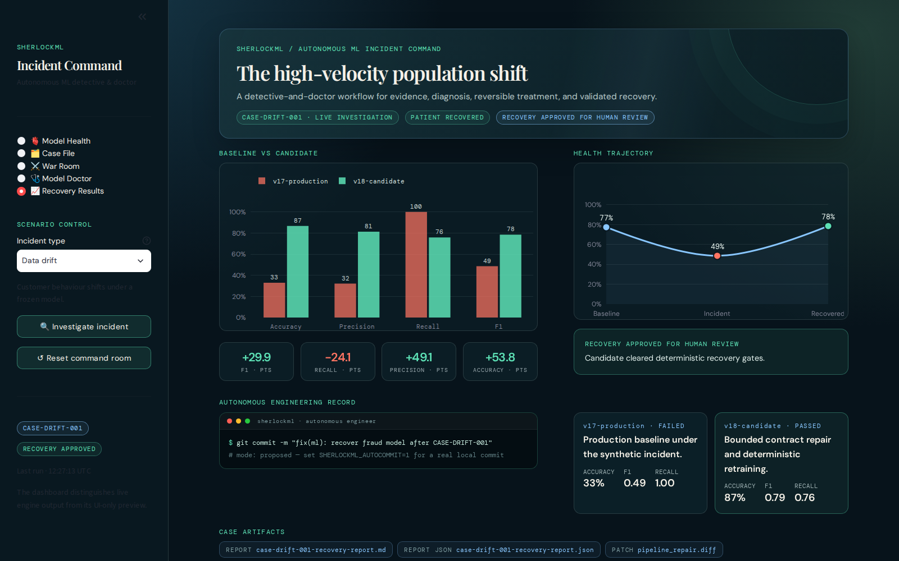
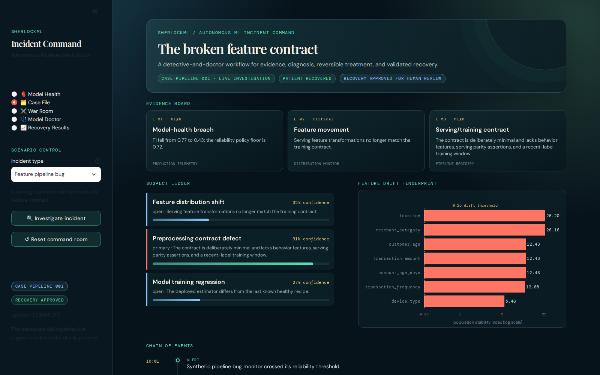
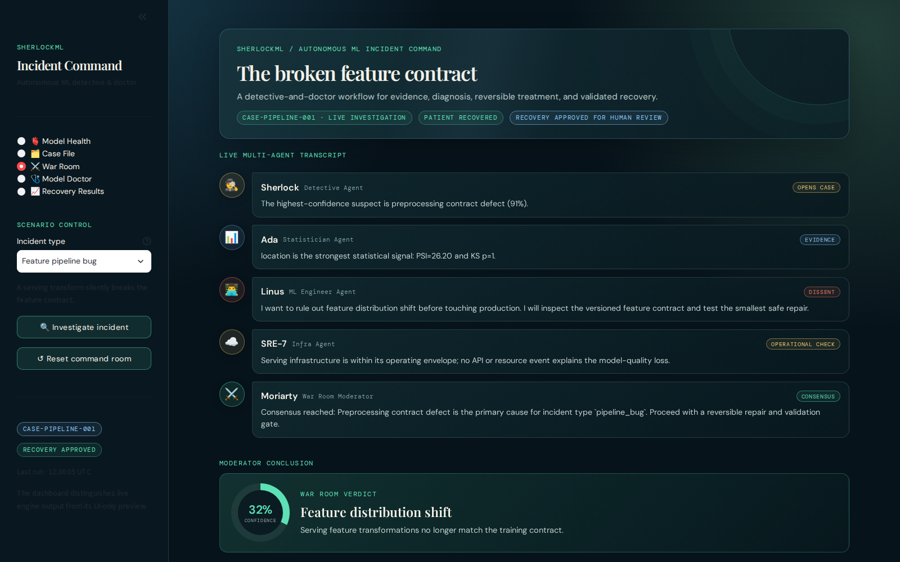
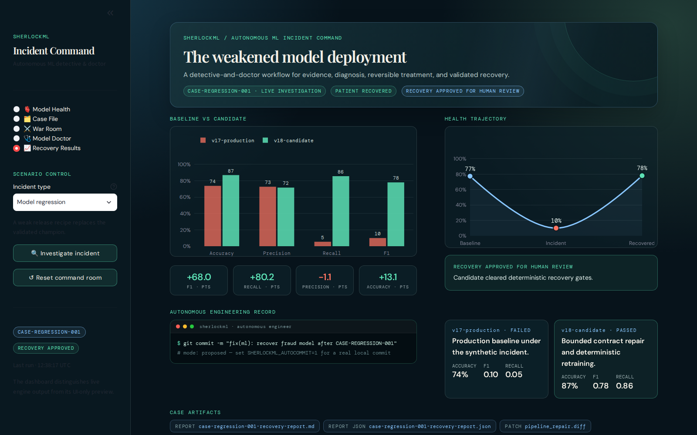

# SherlockML — Demo Walkthrough

> **An autonomous AI detective and doctor for machine-learning systems.**
> This walkthrough follows one complete live investigation, screen by screen,
> and explains what every element on the dashboard means and why it is there.

SherlockML stages a realistic ML reliability incident against a synthetic
fraud-detection model, then lets a team of specialist agents work the case:
a **Detective** gathers evidence, a **Statistician** measures the data, an
**Infra agent** rules out the platform, a **War Room** debates the root cause,
an **Engineer** writes a bounded repair, an **Experiment agent** proves the fix
on real retrained models, and a **Model Doctor** signs the treatment plan —
always ending in *approval for human review*, never an automatic deployment.

Everything below was captured from a **live run** of the engine
(`CASE-DRIFT-001`, the data-drift scenario), not from mockups.

---

## 1. Launch the command room

```bash
python3 -m venv .venv && source .venv/bin/activate
make install         # installs the package plus dev tooling
make run-api         # terminal 1 — FastAPI engine on http://127.0.0.1:8788
make run-ui          # terminal 2 — Streamlit control room on http://127.0.0.1:8502
```

Open <http://127.0.0.1:8502>. The dashboard boots into a clearly labelled
**interactive preview** (`PREVIEW-001`) so the room is never empty; the moment
you run a real investigation, every panel switches to live engine output and
the hero banner flips to `LIVE INVESTIGATION`.

**To start the demo:** in the sidebar under *Scenario control*, keep
**Data drift** selected and press **🔍 Investigate incident**. The full
investigation — evidence collection, statistical analysis, the debate, a
pipeline repair, retraining, validation, and the final report — runs in a few
seconds on a laptop.

---

## 2. Model Health — the patient's bedside monitor



The first page frames the incident as a medical case.

- **Hero banner.** The incident title generated for this case ("The
  high-velocity population shift"), the case id chip
  (`CASE-DRIFT-001 · LIVE INVESTIGATION`), the patient state
  (`PATIENT RECOVERED`), and the workflow status
  (`RECOVERY APPROVED FOR HUMAN REVIEW`).
- **Phase stepper.** Six stages — `ALERT → EVIDENCE → DEBATE → REPAIR →
  VERIFY → REPORT` — derived from the run's timeline. Completed phases glow
  mint; the current phase is gold.
- **Patient avatar.** The model itself, with a pulsing status ring and an
  animated ECG line. It is coral and feverish (🤒) while the case is critical
  and settles to mint (😌) once the candidate clears its gates.
- **Health gauge.** The model's health score (F1 expressed as a percentage)
  on a dial with red/amber/green risk bands. The gold needle marks the
  pre-incident baseline, and the delta below the number shows the recovery
  relative to that baseline.
- **Vital signs.** Four cards: the pre-incident baseline (77%), health at the
  moment of the alert (49%, −29 points), the recovery signal after treatment
  (78%, +30 points of candidate lift), and serving latency with the workflow
  status.
- **Investigation pulse.** The chronological event feed. Each entry is one
  agent completing its step — the alert, the statistician's ranking, the
  infra rule-out, the debate, the repair, the verification, the decision, the
  record, and the report.

**What to say:** *"The model hasn't crashed — it still answers every request.
Its F1 quietly fell from 77% to 49%. That silent failure is exactly what
SherlockML is built to catch."*

---

## 3. Case File — evidence before conclusions



The Detective's output: observable evidence first, hypotheses second.

- **Evidence board.** Three cited exhibits, each with a source and strength:
  - **E-01 — Model-health breach** (production telemetry): F1 fell from 0.77
    to 0.49 against a 0.72 policy floor.
  - **E-02 — Feature movement** (distribution monitor): production behaviour
    is outside the training distribution.
  - **E-03 — Serving/training contract** (pipeline registry): the versioned
    feature contract is minimal and unguarded.
- **Suspect ledger.** The three competing root-cause hypotheses with animated
  confidence bars: *Feature distribution shift* (88%, primary, coral),
  *Preprocessing contract defect* (41%, open), and *Model training
  regression* (27%, open). Nothing is deleted — ruled-out suspects stay on
  the board with their rationale.
- **Feature drift fingerprint.** The Statistician's real measurements: one
  PSI (population stability index) bar per feature, colour-coded by severity,
  on a log scale with the industry 0.25 material-drift threshold drawn as a
  dotted line. In this scenario `transaction_amount` reads PSI 6.09 — roughly
  24× beyond the threshold — because the synthetic population genuinely
  shifted. These numbers come from actual PSI/KS computations over the
  generated dataframes, not hand-typed values.
- **Chain of events.** A compact copy of the timeline for cross-reference.

**What to say:** *"The detective doesn't guess. Three exhibits, three
suspects, each with a confidence score — and the statistician's chart shows
exactly which features moved and by how much."*

---

## 4. War Room — recorded disagreement, then consensus



Root-cause analysis as a transcript rather than a single opaque answer.

- **The transcript.** Five agents speak in turn, each in a chat bubble with an
  avatar and a stance chip:
  - **Sherlock** (Detective, `OPENS CASE`) states the leading suspect and its
    confidence.
  - **Ada** (Statistician, `EVIDENCE`) brings the measurements: PSI and the
    KS test verdict for the strongest feature.
  - **Linus** (ML Engineer, `DISSENT`, coral chip) pushes back — he wants the
    pipeline contract ruled out before anyone touches production. Recorded
    dissent is the point: the system documents disagreement instead of
    fabricating certainty.
  - **SRE-7** (Infra, `OPERATIONAL CHECK`) reports latency, error rate, and
    memory are inside the operating envelope — clearing the platform as a
    suspect.
  - **Moriarty** (Moderator, `CONSENSUS`, mint chip) closes the case only
    after the claims are compared, and authorises a *reversible* repair with
    a validation gate.
- **Moderator conclusion.** The verdict card: the primary suspect with an 88%
  confidence ring and the one-line rationale.

**What to say:** *"Notice the red chip — the engineer disagrees, on the
record. The moderator only resolves the case after the dissent is answered.
That's how real incident reviews work."*

---

## 5. Model Doctor — diagnosis and prescription



The technical verdict translated into a treatment plan.

- **Patient record.** The diagnosed condition (*Feature distribution shift*),
  its severity (HIGH), the bedside note, and a **recovery-probability ring**
  (94%) — the doctor's estimate given the validated treatment and the
  deterministic gates.
- **Treatment plan.** Three numbered prescriptions for this diagnosis:
  refresh the training window with recent labelled traffic, promote the
  behaviour features that now carry the fraud signal, and install PSI/KS
  guardrails before the next deployment.
- **Evidence supporting treatment.** The exhibits that justify the
  prescription, carried over from the case file so the plan is auditable.

**What to say:** *"Like a real doctor, it doesn't just name the disease — it
prescribes a treatment, estimates the odds, and cites the evidence for both."*

---

## 6. Recovery Results — proof, not promises



The Experiment agent actually retrains a candidate model and evaluates it on
the same deterministic incident window. This page is the receipt.

- **Baseline vs candidate.** Grouped bars for accuracy, precision, recall and
  F1: the failed `v17-production` model (coral) against the treated
  `v18-candidate` (mint). Below, four delta chips summarise the movement —
  in this run F1 +29.9 points and precision +49.1 points.
  - A subtle but honest detail: the *failed* baseline can show very high
    recall — a model that flags almost everything catches every fraud while
    being useless. Precision is what collapsed, and the chart makes that
    visible.
- **Health trajectory.** The three-act arc as a chart: 77% → 49% → 78%.
- **Approval banner.** `RECOVERY APPROVED FOR HUMAN REVIEW` — the candidate
  cleared explicit gates (minimum F1 improvement, F1 floor, recall floor).
  If it hadn't, this banner would say so and the case would return for human
  investigation instead of claiming success.
- **Autonomous engineering record.** A terminal card showing the commit the
  engineer agent prepared for its bounded pipeline-contract repair. With
  `SHERLOCKML_AUTOCOMMIT=1` it makes a real local commit and the card shows
  the SHA; by default it stays in safe "proposed" mode.
- **Case artifacts.** Chips linking the generated Markdown report, the
  machine-readable JSON report, and the pipeline repair diff — every claim on
  screen has a file behind it.

**What to say:** *"This is a genuinely retrained model evaluated on the same
incident data — F1 back from 0.49 to 0.79, every gate passed, the diff and the
report saved. And the final act is asking a human for permission. That's
autonomy you can actually ship."*

---

## 7. The other two scenarios

The same workflow diagnoses two more failure modes. Each produces different
evidence, a different debate, a different repair — and a different chart
fingerprint.

### Feature pipeline bug — `CASE-PIPELINE-001`



A serving release silently rescales numeric features and breaks category
mappings while the *world stays the same*. The drift fingerprint looks
completely different: categorical features (`location`,
`merchant_category`) spike to extreme PSI because production categories no
longer match training, and the suspect ledger flips — *Preprocessing contract
defect* becomes primary at 91%.



The War Room reaches a different consensus, citing the contract evidence, and
the repair restores the validated preprocessor instead of retraining on new
data.

### Model regression — `CASE-REGRESSION-001`



A weak two-feature model was deployed over the validated champion; the data
itself is stable. Health collapses to 10%, and the recovery — rolling back to
the champion recipe — is the most dramatic: recall from 0.05 to 0.86 and
F1 +68 points, all visible in the comparison chart.

**Reset between runs** with **↺ Reset command room**; it restores the
deterministic pipeline-contract baseline so every demo starts from the same
state.

---

## 8. What is real, and what is bounded

Honesty is part of the pitch:

- **Real:** the datasets (synthetic but generated fresh each run), the
  trained XGBoost / logistic-regression models, the PSI and KS statistics,
  the retraining experiment, the validation gates, the diff artifact, the
  MLflow (SQLite) experiment record, and the generated reports.
- **Bounded by design:** no customer data, no hosted LLM required, no remote
  pushes, and no automatic deployment — the strongest outcome the system can
  produce is *approved for human review*.
- **Deterministic:** a fixed seed makes every scenario repeatable, which is
  exactly what you want mid-demo.

## 9. 90-second talk track

1. **Model Health** — "This model didn't crash. It got sick. F1 fell from
   77% to 49% while it kept answering requests."
2. **Investigate** — "One click. A detective, a statistician, an SRE, an
   engineer and a doctor work the case in seconds."
3. **Case File** — "Evidence first: three exhibits, three suspects, and the
   drift chart showing transaction_amount 24× over the threshold."
4. **War Room** — "They argue. The engineer dissents — on the record. The
   moderator resolves the case only after the dissent is answered."
5. **Model Doctor** — "Diagnosis, severity, a three-step prescription, and a
   94% recovery estimate."
6. **Recovery Results** — "The prescription was tested: a real retrained
   model, F1 back to 0.79, every gate passed, the fix committed — and the
   last act is asking a human to approve. Detective, doctor, recovery."
